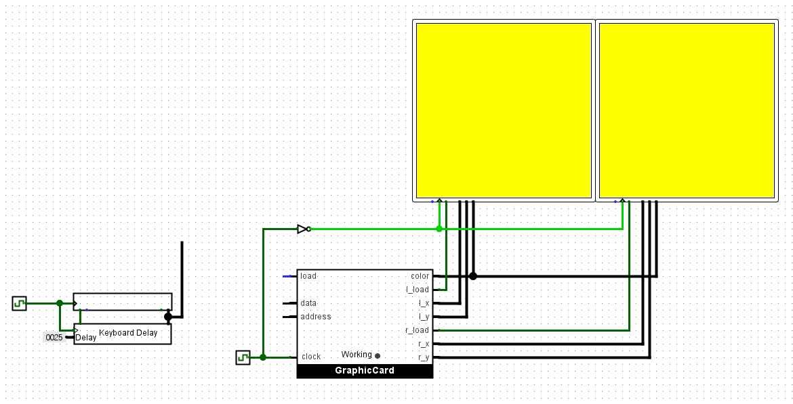

# n2tLogisimIO
Nand2Tetris keyboard and screen component, composited in pure logisim/logisim evolution

# What's inside
 - `KeyboardDelayClassic.circ`
   - Keyboard delay circuit for logisim classic.
   - Use [logisimn2t](https://github.com/itoshkov/logisimn2t) for screen.
 - `hackpcEvolutionComponent.circ`
   - Keyboard delay circuit and 'graphic card' for logisim evolution.

  # How to use
   - Keyboard Delay
     - Connect `Read Enable` pin of keyboard with `key_clock_enable` pin of delay, `Data` pin of keyboard with `key_in` pin, and set delay (16-bit number).
   - Graphic Card
     - Refer to image / 'Usage' circuit in hackPCEvolutionComponent.circ
     - Output component is two `RGB Video` (Logisim-evolution only), with X/Y size set to 256 and color mode set to Grayscale (4bit)
    
   

# Note about graphic card
Sadly speed cap of `RGB Video` component is one pixel per a clock cycle, so too rapid command for screen manipulation may cause delay and can be discarded.
I used queue with 13-bit address (8K) to minimize command discard, if program loaded edits screen byte in, like, every 10 instructions, expect delay and eventual dismissed change.
